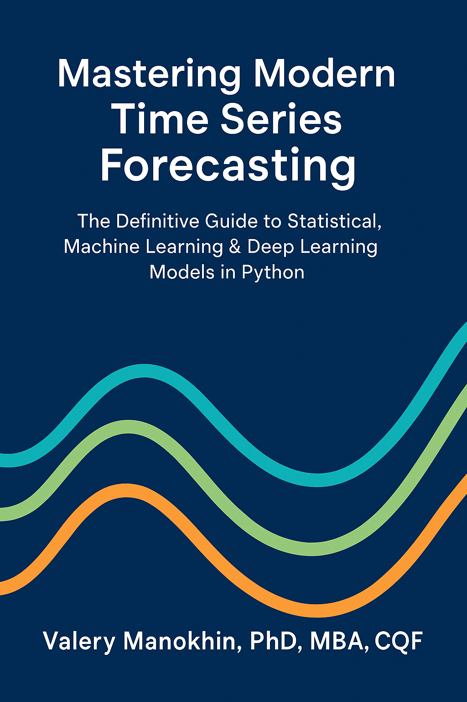

# 📘 Mastering Modern Time Series Forecasting: The Complete Guide

  

**By Valeriy Manokhin, PhD, MBA, CQF**  
🔥 Trusted by data leaders in 100+ countries  
🔗 [Buy Standard Edition – Gumroad](https://valeman.gumroad.com/l/MasteringModernTimeSeriesForecasting)  
🔗 [Buy Pro Edition – Early Access](https://valeman.gumroad.com/l/MasteringModernTimeSeriesForecastingPro)  
🎁 [Forecasting + Conformal Prediction Mastery Bundle](https://valeman.gumroad.com/l/Forecasting_Conformal_Prediction_Mastery_Bundle)

---

## 🚀 Go Deeper: Join the Live Cohort Experience

📚 Want to accelerate your skills with hands-on feedback from the author and top peers around the world?

🎓 **Join the Live Cohort Courses on Maven**:

- 🧠 [Modern Forecasting Mastery](https://maven.com/valeriy-manokhin/modern-forecasting-mastery) – Full forecasting workflow with live sessions, case studies, and model deployment
- 🔍 [Applied Conformal Prediction](https://maven.com/valeriy-manokhin/applied-conformal-prediction) – Uncertainty, risk-aware modeling, and prediction intervals from theory to code

Both courses include:
- 💬 Live Q&A and AMAs with Valeriy
- 🌍 Global peer group of data leaders
- 🛠️ Hands-on projects and collaborative builds

---

## 💎 What Makes This Book Different

Most forecasting books fall short — they’re either outdated, overly simplistic, or skip real-world details. Some classics focus only on traditional methods, while newer ones skim the surface of modern tools like ML and deep learning.
The result? Fragile systems that work in demos but fail in production.
This book is different.
Mastering Modern Time Series Forecasting is a clear, practical, and end-to-end guide to building robust forecasting systems using statistical, ML, and deep learning methods.
Whether you're starting out or deploying models at scale, you'll get the tools, understanding, and workflows to build forecasting solutions that actually work.

**Mastering Modern Time Series Forecasting** isn't just another book — it's a **practical guide** for professionals who want to deploy powerful forecasting systems that work under real-world pressure.

✅ Full coverage: ARIMA, XGBoost, N-BEATS, TFT, Conformal Prediction, FTSMs  
✅ Built for business & research impact  
✅ Transparent, well-documented, production-ready code  
✅ Lifetime updates and access to private Discord

---

## 🧠 What You’ll Learn

- Forecastability of time series
- Forecast evaluation, validation, metrics that matter
- Feature engineering and model tuning
- Deep learning for time series (Transformers, N-BEATS)
- Probabilistic forecasting, conformal prediction
- Real-world case studies: Retail, finance, energy

---

## ✍️ About the Author

**Valeriy Manokhin**, PhD, MBA, CQF — a forecasting expert and ML researcher who has:

- 🧪 Designed systems for global companies and startups: Stanley Black & Decker, GfK, and others  
- 🥇 Beat major consultancies (like BCG) in forecasting bids  
- 🌐 Taught professionals in 30+ countries  
- 🧠 Published in top ML and forecasting journals  
- 🎯 Built training programs trusted by Amazon, Meta, Apple, and BlackRock

---

## 📦 What’s in This Repo

- `notebooks/` – Forecasting examples and case studies  
- `datasets/` – Public datasets cleaned for time series analysis  
- `utils/` – Evaluation metrics, pipelines, tuning functions  
- `README.md` – You’re here!

---

## 💸 Pricing

| Edition         | Price   | Includes                                                                 |
|-----------------|---------|--------------------------------------------------------------------------|
| Standard        | $40     | Full book + notebooks + updates + Discord                                |
| Pro (Early)     | $65     | All above + bonus pack: templates, Q&A, tuning tools                     |
| Bundle (CP)     | Varies  | [Includes Conformal Prediction book](https://valeman.gumroad.com/l/Forecasting_Conformal_Prediction_Mastery_Bundle) |

⚠️ Pro price will rise to $150+ at full release.

---

## 🎓 Join the Global Learning Experience

✅ Learn with top peers from Amazon, Meta, Nike, universities & startups  
✅ Get expert feedback on your own forecasting projects  
✅ Go from “copy-paste code” to production-ready decision intelligence

📅 **[Register for Forecasting Mastery](https://maven.com/valeriy-manokhin/modern-forecasting-mastery)**  
🔬 **[Enroll in Applied Conformal Prediction](https://maven.com/valeriy-manokhin/applied-conformal-prediction)**

---

📈 Forecast with confidence.  
Build systems that scale.  
Advance your skills, your models, and your career.

👉 [Get the Book Now](https://valeman.gumroad.com/l/MasteringModernTimeSeriesForecasting)

